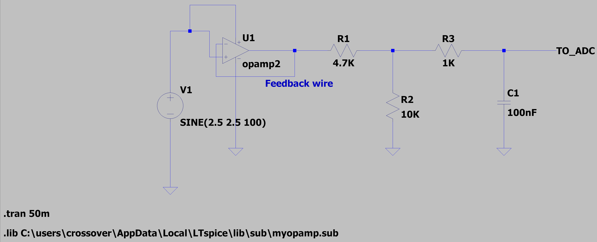
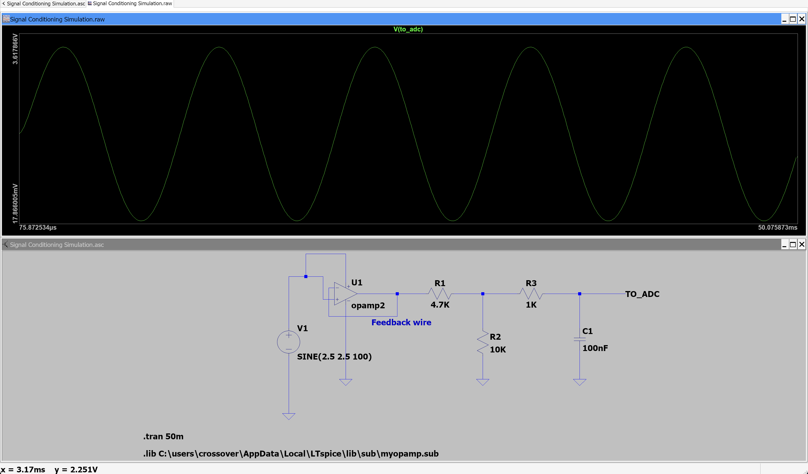

# RetroLink ECU

**Custom signal conditioning and embedded control system for a 1995 Toyota Pickup (3VZ-E)**

RetroLink bridges legacy automotive hardware with modern embedded systems. It reads analog sensor signals from a 30-year-old engine, conditions them for a modern microcontroller, and communicates over CAN bus — the same protocol used in every vehicle made today.

## Why This Exists

I daily-drive a 1995 Toyota Pickup with the 3VZ-E V6. The truck has no OBD-II port, no CAN bus, and no way to read sensor data digitally. RetroLink solves that by tapping into the analog sensor outputs (coolant temp, throttle position, oil pressure) and converting them into digital readings on an STM32 microcontroller.

## Architecture

```
Analog Sensors (0-5V)
        │
        ▼
┌─────────────────────┐
│  Signal Conditioning │  ← Voltage follower + divider + RC filter
│  (LM358 + passives) │     Scales 5V → 3.3V, filters noise
└────────┬────────────┘
         │
         ▼
┌─────────────────────┐
│  STM32F446RE MCU    │  ← FreeRTOS: sensor task, CAN task, display task
│  (Nucleo-64 board)  │
└────────┬────────────┘
         │
         ▼
┌─────────────────────┐
│  CAN Bus (500 kbps) │  ← TJA1050 transceiver, standard automotive protocol
└─────────────────────┘
```

## Signal Conditioning Circuit

The analog front-end has three stages:

| Stage | Components | Purpose |
|-------|-----------|---------|
| Buffer | LM358 op-amp (voltage follower) | High-impedance input — doesn't load the sensor |
| Voltage Divider | 4.7kΩ / 10kΩ resistors | Scales 0-5V down to 0-3.4V (ADC-safe) |
| Low-Pass Filter | 1kΩ + 100nF (fc ≈ 1.6 kHz) | Removes high-frequency engine electrical noise |

### LTspice Simulation

The circuit was simulated in LTspice to verify the voltage scaling and filter response before building hardware.

**Schematic:**



**Waveform — 100 Hz input (sensor signal passes through cleanly):**



## STM32 Firmware

Built with STM32CubeMX + FreeRTOS on the STM32F446RE (Nucleo-64).

**Peripherals configured:**
- **ADC1** (PA0, PA1) — reads conditioned sensor voltages
- **CAN1** (PB8, PB9) — 500 kbps, transmits sensor data
- **I2C1** (PB6, PB7) — OLED display output
- **USART2** (PA2, PA3) — debug serial over USB

**FreeRTOS tasks:**

| Task | Priority | Function |
|------|----------|----------|
| sensorTask | Above Normal | Reads ADC channels, applies calibration |
| canTask | Normal | Packs sensor data into CAN frames, transmits |
| displayTask | Below Normal | Updates OLED with live readings |

## Project Structure

```
retrolink-ecu/
├── README.md
├── simulation/
│   ├── Signal Conditioning Simulation.asc    # LTspice schematic
│   └── myopamp.sub                           # Op-amp model file
├── firmware/
│   └── RetroLink/                            # STM32CubeMX project
│       ├── RetroLink.ioc                     # CubeMX config
│       └── Core/Src/main.c                   # Application code
├── docs/
│   └── images/
│       ├── schematic.png
│       └── waveform-100hz.png
└── hardware/
    └── bom.md                                # Bill of materials
```

## Bill of Materials

| Component | Part | Qty | Purpose |
|-----------|------|-----|---------|
| MCU Board | STM32F446RE Nucleo-64 | 1 | Main controller |
| Op-Amp | LM358 | 1 | Voltage follower buffer |
| CAN Transceiver | TJA1050 | 1 | CAN bus interface |
| Resistor | 4.7kΩ | 1 | Voltage divider (top) |
| Resistor | 10kΩ | 1 | Voltage divider (bottom) |
| Resistor | 1kΩ | 1 | RC filter |
| Capacitor | 100nF | 1 | RC filter |
| Display | SSD1306 OLED (128×64) | 1 | Live sensor readout |

## Tech Stack

- **Languages:** C
- **MCU:** STM32F446RE (ARM Cortex-M4, 180 MHz)
- **RTOS:** FreeRTOS
- **Tools:** STM32CubeMX, LTspice, Git
- **Protocols:** CAN Bus (500 kbps), I2C, UART, ADC

## Status

- [x] Signal conditioning circuit designed and simulated
- [x] STM32CubeMX project configured
- [ ] FreeRTOS tasks implemented
- [ ] CAN bus communication tested
- [ ] Physical build and integration

## License

MIT
